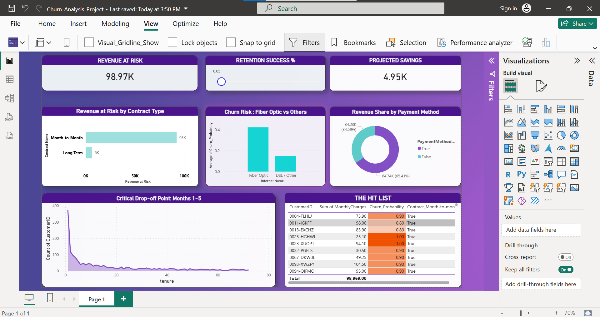

# 📉 Customer Churn Risk Simulator

## 📌 Project Overview
In the subscription economy, retaining customers is 5x cheaper than acquiring new ones. This project analyzes a dataset of 7,000+ telecom customers to identify who is at risk of leaving and why. 

**Business Goal:** Build a predictive model and an interactive dashboard to help the retention team prioritize high-risk customers and reduce churn by 10-20%.

## 🛠️ Tech Stack
* **Python:** Data Cleaning, Feature Engineering, Random Forest Machine Learning Model (Accuracy: ~80%).
* **SQL:** Customer Segmentation (High/Medium/Low Risk) and Data Warehousing logic.
* **Power BI:** Interactive Dashboard with "What-If" parameters to simulate financial savings.

## 📊 Key Insights
1.  **High Risk Group:** Customers on "Month-to-Month" contracts with "Fiber Optic" internet are the most likely to churn.
2.  **Payment Method:** "Electronic Check" users have a churn rate 2x higher than other payment methods.
3.  **Financial Impact:** Simulating a 20% retention success rate on the high-risk segment saves approximately **$19,000 per month** in recurring revenue.

## 📂 Files in this Repository
* `Churn_Analysis.ipynb`: The Python code for data processing and ML modeling.
* `Churn_Analysis_Project.pbix`: The downloadable Power BI dashboard file.
* `Project_Queries.sql`: SQL scripts used for data analysis.
* `Ready_For_PowerBI.csv`: The processed dataset used for visualization.

## 🚀 How to Use the Dashboard
1.  Download the `.pbix` file.
2.  Open in Power BI Desktop.
3.  Use the **"Retention Success %"** slider to simulate how much revenue can be saved by retaining different percentages of at-risk customers.
